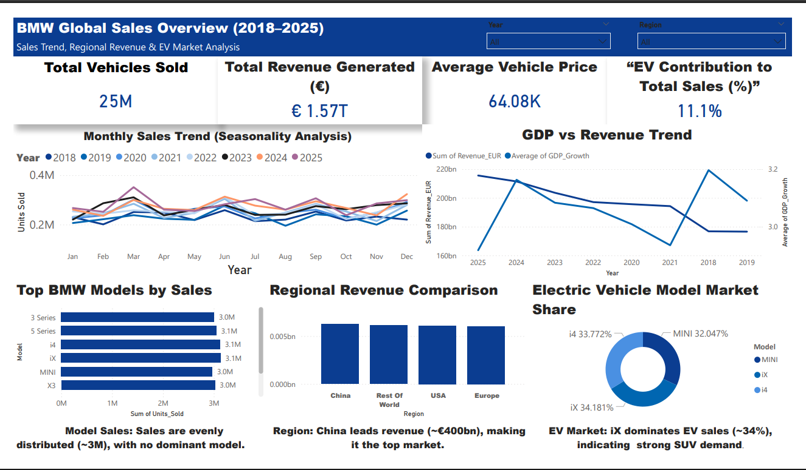

# 🚗 BMW Global Sales Analysis and Performance Insights (2018–2025)

**Tools & Technologies:** Power BI | Excel | Power Query | DAX | Data Modeling  
**Domain:** Sales Analytics | Automotive  

---

## 🧩 Project Overview
This project analyzes BMW’s global sales performance from 2018 to 2025, focusing on vehicle sales, revenue generation, regional performance, product distribution, and electric vehicle (EV) adoption.

The dataset was sourced from Kaggle and processed using Excel and Power Query. A structured **star schema data model** was implemented in Power BI to enable efficient analysis and interactive dashboard development.

The analysis also incorporates economic indicators such as GDP growth and fuel price index to provide additional context for sales performance.

---

## 🎯 Project Objectives
- Analyze monthly and yearly sales trends  
- Evaluate regional revenue contribution across key markets  
- Assess model-wise performance and product distribution  
- Analyze EV segment performance and contribution to total sales  
- Examine the relationship between economic indicators and revenue trends  
- Support data-driven decision-making  

---

## 📁 Data Source
- **Dataset:** BMW Global Sales Dataset (Kaggle)  
- **Time Period:** 2018–2025  
- **Processing Tools:** Excel, Power Query  
- **Visualization Tool:** Power BI  

---

## ❓ Problem Statement
- Which regions generate the highest revenue?  
- Which BMW models contribute most to total sales?  
- Do sales show consistent patterns over time?  
- How competitive is the EV segment?  
- How do economic conditions relate to vehicle sales?  
- What is the EV contribution to total market share?  

---

## 🧾 Dataset Attributes

| Attribute Name | Data Type | Description |
|--------------|----------|------------|
| Year | Integer | Sales year |
| Month | Integer | Month number |
| Month Name | Text | Month name |
| Region | Text | Sales region |
| Model | Text | Vehicle model |
| Units_Sold | Whole Number | Total vehicles sold |
| Revenue_EUR | Currency | Revenue generated |
| EV_Sales | Whole Number | Electric vehicle sales |
| GDP_Growth | Decimal | Economic indicator |
| Fuel_Price_Index | Decimal | Fuel trend indicator |
| Avg_Price_EUR | Currency | Average vehicle price |
| BEV_Share | Decimal | EV share |
| Premium_Share | Decimal | Premium segment contribution |

---

## 🧹 Data Preprocessing

### Data Cleaning (Power Query)
- Removed duplicate records  
- Handled missing values  
- Standardized column formats  

### Data Transformation
- Created calculated fields (Avg_Price_EUR, BEV_Share, Premium_Share)  
- Derived EV-related indicators  

### Data Modeling
- Implemented **Star Schema**  
- **Fact Table:** Sales Data  
- **Dimension Tables:** Year, Month, Region, Model  

---

## 🧮 DAX Measures
- **Total Vehicles Sold** = SUM(Units_Sold)  
- **Total Revenue** = SUM(Revenue_EUR)  
- **Average Vehicle Price** = DIVIDE([Total Revenue], [Total Vehicles Sold])  
- **EV Contribution %** = DIVIDE(SUM(EV_Sales), SUM(Units_Sold))  

---

## 📊 Analysis & Visualizations
- 📈 **Line Chart:** Monthly Sales Trend with dynamic year filtering to analyze patterns over time  
- 📊 **Bar Chart:** Top-performing BMW models by sales, sorted with percentage contribution  
- 📊 **Horizontal Bar Chart:** Regional revenue comparison highlighting China as the leading market  
- 🍩 **Donut Chart:** EV market share distribution across iX, i4, and MINI models  
- 📌 **KPI Cards:** Key metrics including Total Vehicles Sold, Total Revenue, Average Vehicle Price, and EV Contribution (%) with performance indicators    

---

## 📊 Dashboard Preview

The Power BI dashboard provides an interactive overview of BMW’s global sales performance, combining key metrics, trends, and comparisons.

### 🔍 Dashboard Highlights
- **KPI Summary:** 25M vehicles sold, €1.57T revenue, €64.08K avg price, 11.1% EV share  
- **Sales Trend:** Monthly performance across 2018–2025  
- **Model Analysis:** Balanced sales (~3M units per model)  
- **Regional Analysis:** China leads revenue (~€400bn)  
- **EV Insights:** iX leads EV segment (~34% share)  

---

## 📈 Key Performance Metrics
- **Total Vehicles Sold:** 25 Million  
- **Total Revenue:** €1.57 Trillion  
- **Average Vehicle Price:** €64.08K  
- **EV Contribution:** 11.1%  

---

## 🔍 Key Insights
- China is the highest revenue-generating region (~€400bn)  
- BMW maintains a balanced product portfolio (~3M units per model)  
- EV models show near-equal distribution, with iX slightly leading (~34%)  
- Monthly sales show stable patterns with moderate fluctuations  
- EV contribution (11.1%) indicates early-stage adoption with growth potential  
- Revenue shows partial alignment with GDP, but no strong direct relationship  

---

## 📌 Business Recommendations
- Expand EV production and marketing in high-demand regions like China  
- Strengthen EV portfolio to capture future growth opportunities  
- Maintain balanced product strategy across models  
- Use economic indicators as supporting inputs for planning  
- Continue premium positioning to sustain pricing advantage  

---

## 🏁 Conclusion
This project demonstrates how data analytics and visualization can generate actionable insights into automotive sales performance.

### Final Takeaways
- China is the dominant revenue market  
- Sales patterns are stable with moderate variation  
- Product portfolio is evenly distributed  
- EV adoption is growing but still in early stages  
- Economic indicators provide context but are not sole drivers of sales  

---

## 👨‍💻 Author
**Nitesh Raj R G**  
Aspiring Data Analyst  

🌐 GitHub: https://github.com/rgniteshraj  
💼 LinkedIn: https://www.linkedin.com/in/niteshrajrg  
📧 Email: rgniteshraj@gmail.com  
